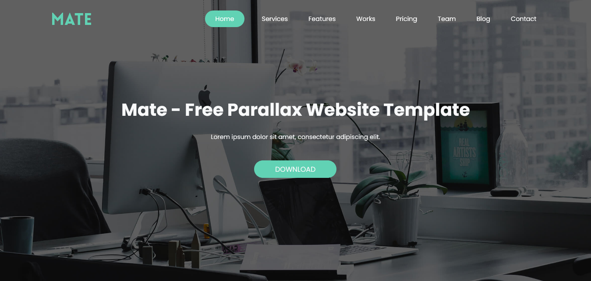

# Mate - Bootstrap Template landing page

‘Mate’ is a free One Page HTML template suited for a freelancer or agency portfolio. Features include a fixed header navigation (that smooth scrolls to sections), parallax scrolling, portfolio with category filter and Lightbox gallery, pricing table, stats, team, testimonial slider and a contact form.

## Table of contents

- [Overview](#overview)
  - [The challenge](#the-challenge)
  - [Screenshot](#screenshot)
  - [Links](#links)
- [My process](#my-process)
  - [Built with](#built-with)
- [Author](#author)

## Overview

### The challenge

Users should be able to:

- View the optimal layout for the site depending on their device's screen size
- See hover states for all interactive elements on the page

### Screenshot

### Links

- Original Template : [Click Here](https://preview.uideck.com/items/mate/)
- My own Template : [Click Here](https://mate-template.netlify.app/)

## My process

### Built with

- Semantic HTML5 markup
- Sass
- Bootstrap 5

## Author

- Website - [Shaher Ashraf](shaherashraf77@gmail.com)

